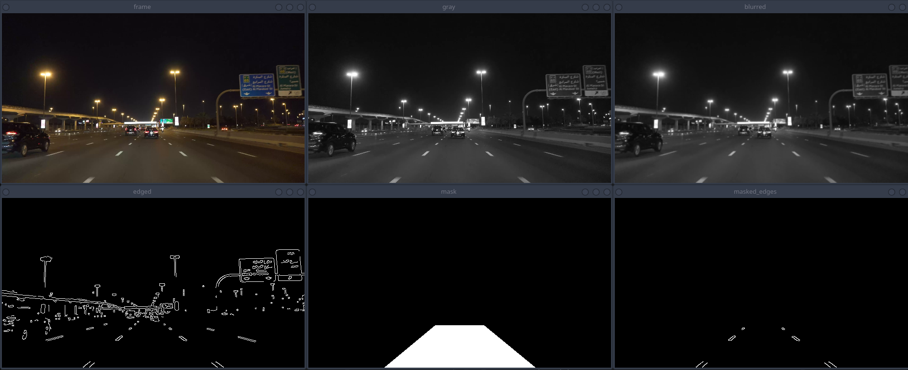
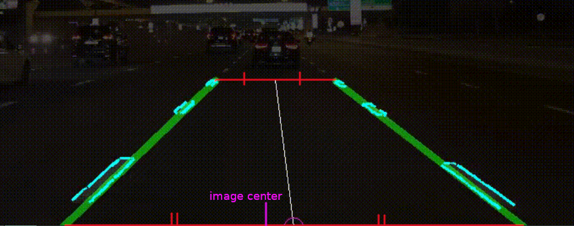

## Task
Разработать программу для контроля движения машинки в полосе с прирывистой дорожной разметкой используя видеопоток.

### Result


### Build
##### Meson
```
meson setup build
meson compile -C build
```
##### CMake
```
mkdir build && cd build
cmake ..
make
```
#### Run:
```
./build/RTSoftSummerSchool2021-practice data/good-video.wemb
```
### Description
##### Algorithm (for every frame)
1. The image gets converted to grayscale
2. Then Gaussian blur gets applied
3. Canny edge detection algorithm finds edges
4. Edges get filtered via region of interest
5. Probabilistic Hough transform algorithm finds lines
6. Many detected lines get merged into two road lines
7. Central line is calculated as shown (trapezoid)
8. The lower end of the central line should be roughly in the middle of the screen  
Difference between central line's lower end and screen's middle defines vehicle's behaviour (polymorphic strategy)  
```
controller.SetMovingStrategy(std::make_unique<PrintingMovingStrategy>(std::cout));  // car is a lie, just print the value
controller.Move(distance);
/*
distance:
< 0 move left
> 0 move right
= 0 everything is ok
the absolute value is pretty useless since it is calculated this way: (road center - screen center) / screen.width
*/
```
9. Detected lines, two main lines, central line (and it's end) are visualized during the whole process  
```
struct Visualization { /*virtual methods*/ }
struct DefaultVisualization : Visualization { /*overrides*/ }
```

##### Steps of road lines detection

Note: mask's shape (step 4) highly depends on the video
##### Trapezoid line calculations

